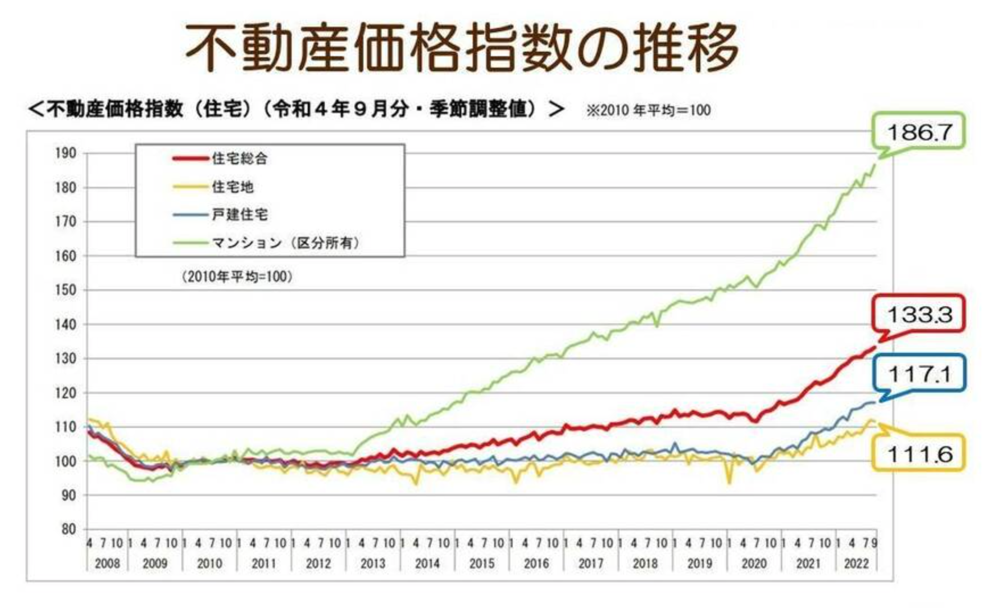

### 概要

#### マイホームの買いどき

- これからマイホーム選びを始めようと思っているが、何から手を付けていいか分からない方
- 住むエリアや物件種別で迷われている方
- マイホームを今買うべきか、もう少し待ってから買うべきか、購入のタイミングを探っている方

住宅の価格は、「東京オリンピックをピークに下がるのでは……」という予測もありましたが、実際にはオリンピックを過ぎても上がり続けています。特に都心の中心部のマンションは引き続き、人気が高い状況です。

住宅地や戸建てについても同様で、全国的にみても上昇傾向にありますが、マンションに比べるとまだ手が出しやすい状況かもしれません。いずれにしても「日本全国で住宅価格が上がっている」という結論で間違いないでしょう。

#### 住宅価格が上昇している理由
- 木材の価格高騰のこと: 簡単にいうと木材不足や木材の価格高騰のことを指します。日本の木材の70%は輸入に頼っています。日本の木材の70%は輸入に頼っている。新型コロナ感染症の流行により、経済活動が停止し、木材の供給が不足している。また、アメリカや中国でも新築戸建が増加して木材需要が発生したうえ、虫の害や山火事などの自然災害の影響も重なりました。
- コロナ禍で「自宅」について考える人が増えた: コロナ禍で世界的にリモートワークが推し進められた結果、自宅の快適さが以前よりも求められるようになりました。出勤しないことで、郊外や地方への住み替えも注目されています。また、新築ではなく中古物件をリフォームして住むという方も増えています。

#### 4つの家の特徴

住むエリアや物件種別で迷われている方は、今一度、日頃の生活リズムや、自分の好きな暮らし方を振り返ってみてください。それぞれの物件ごとのメリットや、エリアのメリットを参考までに記載しておきます。どっちが好みか？と取捨選択していくことで、自分にとっての理想の住まいが明確になってくるはずです。

＜戸建て＞
- 騒音がなくプライバシーも保護できる
- 車を置ける駐車場がついてくる
- 土地を含めて資産になる
- 管理費や修繕積立金など固定費がかからない

＜マンション＞
- オートロックなどセキュリティが充実
- 共用施設がある
- 室内がフラット
- 24時間ゴミ出しできる、宅配ボックスの利用

＜郊外＞
- 広い家が買える
- 自由な家づくりが出来る
- 庭やガレージが持てる
- 日当たりや風通しがよい

＜都心＞
- お店や学校などが多い
- 駅から近いので利便性が高い
- 徒歩で完結できる
- 転売しやすい

### 原文

私たちが知っておきたいお金の知識をお伝えする連載【知っておくと“人生安心”なお金の基本レッスン】。住宅購入費、教育費用、保険いろいろ、家計管理…… お金知識ゼロの人でもわかるように、詳しく丁寧に解説します！　

第10回目のテーマは、【マイホームの買いどき】です。
今回はこんな方にオススメの内容となっています。

・これからマイホーム選びを始めようと思っているが、何から手を付けていいか分からない方
・住むエリアや物件種別で迷われている方
・マイホームを今買うべきか、もう少し待ってから買うべきか、購入のタイミングを探っている方

マンション・戸建て、都心・郊外などたくさんの選択肢がある分、迷いも尽きないマイホーム選びですが、物件種別やエリアにおける価格の違いなど、住宅の最新情報を押さえておくと理想のマイホーム購入に近づけます。また、気になる建築コストなどの最新情報についてもお伝えしあます。あなたにとっての“買いどき”を逃さないように是非この記事をチェックしてくださいね。

住宅価格はオリンピックを過ぎても上がっている
出典 ：国土交通省「不動産価格指数」R4.12.28公表 ©2023 一般社団法人マネーリテラシー推進協会

住宅の価格は、「東京オリンピックをピークに下がるのでは……」という予測もありましたが、実際にはオリンピックを過ぎても上がり続けています。特に都心の中心部のマンションは引き続き、人気が高い状況です。

それを裏付けるデータに、国土交通省の「不動産価格指数」というものがあります。「不動産価格指数」とは、年間約30万件の不動産の取引価格情報をもとに、全国・ブロック別・都市圏別等に不動産価格の動向を指数化したもので、国土交通省が毎月公表しています。

2010年の平均を基準（100）として、価格が上昇していれば数字も上がっていく、とご理解ください。このデータの良い点は、土地・戸建て・マンションなどを含めた全ての不動産価格の全体的な流れがわかること、一般の方がみても比較的分かりやすい資料が多いこと、という点です。

最新データがこちらです（昨年12月28日に公表）。対象期間は令和4年の9月になります。

住宅総合指数・住宅地・戸建て住宅・マンション（区分所有）の4つの価格をおおまかに知ることができるので、これからマイホームを検討している方は指数の動向をこまめにチェックするといいでしょう。最近は価格の動きも早く、数ヵ月で大きく変わることもあります。

グラフを見てみると、住宅総合指数の赤い線が2020年を境に少しずつ上昇していているのが分かります。住宅総合指数（赤の線）の全国平均で見ると、不動産価格指数は対前月比より0.7％も上がっています。続いて、住宅地（黄色の線）ですが、こちらは対前月比より0.3％下がり、戸建住宅（青の線）は対前月比と同じ数字となっています。

特筆すべきはなんと言ってもマンションです。マンション（緑の線）は、対前月比より1.8％上がっています。右肩上がりで上昇している様子が見て取れます。

ここまでをまとめますと、マンション価格はほとんどの地域で大きく上昇しています。住宅地や戸建てについても同様で、全国的にみても上昇傾向にありますが、マンションに比べるとまだ手が出しやすい状況かもしれません。いずれにしても「日本全国で住宅価格が上がっている」という結論で間違いないでしょう。

住宅価格が上昇している理由①「ウッドショック」を知っていますか？
なぜここまで住宅価格が上がってしまったのか？ を考えた時に、切っても切り離せないのが「ウッドショック」です。2021年3月頃から耳にするようになった「ウッドショック」という言葉ですが、1970年代のオイルショックにちなんで名付けられているそう。これからマイホームを検討する方は知っておいた方がいい言葉かもしれません。

ウッドショックとは、簡単にいうと木材不足や木材の価格高騰のことを指します。日本の建築用木材は、その7割を輸入で賄っている現状があります。その輸入木材の調達がさまざまな理由で難しくなったことで、住宅価格にも影響が出ているということなのです。

一因としては、たとえばコロナ禍のロックダウンによって移動が規制されたり、経済活動が停止したことによる供給不足。また、アメリカや中国でも郊外に新築戸建てを立てる人が増加して木材需要が発生したうえ、虫の害や山火事などの自然災害の影響も重なりました。そして、2022年2月に勃発したロシアによるウクライナ侵攻の影響もあります。日本を含む非友好国への木材輸出が一部禁止されています。これも世界的な木材不足に影響していることは間違いないでしょう。

ウッドショックがいつまで続くかは誰にも分かりませんが、どの理由もすぐに解消できるものではないため、今後も厳しい状況が続くことが予想されています。

住宅価格が上昇している理由② コロナ禍で「自宅」について考える人が増えた
前述した通り、不動産価格は全国的に上昇しています。それにも関わらずマイホームが欲しいという理由には、やはりコロナ禍も関係しています。

コロナ禍で世界的にリモートワークが推し進められた結果、自宅の快適さが以前よりも求められるようになりました。出勤しないことで、郊外や地方への住み替えも注目されています。週に何度かの通勤であればと、利便性よりも広さを求めて郊外へ出ていく人も増えたように思われます。実際にリモートワークをするとなると、それなりの部屋数が求められますから、部屋数を増やすとなると都心部では価格的に難しいという理由もあるでしょう。また、新築ではなく中古物件をリフォームして住むという方も増えています。

この記事をご覧になっている方の中にも、コロナ禍で自宅について改めて考えた結果、マイホームを検討しているという方もいらっしゃるかもしれません。いずれにしてもマイホームの購入は人生における大きな買い物、イベントであることは間違いありませんし、住宅ローンの借り入れは日々の家計に大きな影響を与えます。

可能であれば、理想とする住まいをベストなタイミングで購入し、後悔のない住宅購入をしたいですね。では理想の住まいを見つけるにはどうしたらいいでしょうか？　インターネットで検索する前に取り組んでいただきたいことがあります。

理想の住まいに出会うためには？
これからマイホーム選びを始めようと思っているが、何から手を付けていいか分からない方は、ぜひ「どんな住まい方をしたいか？」を考えてみてくださいね。

例えば、新築か中古か、マンションか戸建てか、駅近か郊外か、など理想の暮らしを書き出してみましょう。優先順位が高く、絶対に譲れないものを決めていくと自ずと理想の住まいがみえてくるはずです。

住むエリアや物件種別で迷われている方は、今一度、日頃の生活リズムや、自分の好きな暮らし方を振り返ってみてください。それぞれの物件ごとのメリットや、エリアのメリットを参考までに記載しておきます。どっちが好みか？ と取捨選択していくことで、自分にとっての理想の住まいが明確になってくるはずです。

＜戸建て＞ 

- 独立しているので騒音やプライバシーで揉めにくい
- 車を置ける駐車場がついてくる
- 土地を含めて資産になる
- 管理費や修繕積立金など固定費がかからない

＜マンション＞

- オートロックなどセキュリティが充実
- 共用施設がある
- 室内がフラット
- 24時間ゴミ出しできる、宅配ボックスの利用
 
＜郊外＞ 

- 広い家が買える
- 自由な家づくりが出来る
- 庭やガレージが持てる
- 日当たりや風通しがよい

＜都心＞

- お店や学校などが多い
- 駅から近いので利便性が高い
- 徒歩で完結できる
- 転売しやすい

マイホームを今買うべきか、もう少し待ってから買うべきか、購入のタイミングを探っている方は、一度、ご家族のライフプランを作ってみてはいかがでしょうか？

住宅価格の状況を把握しておくことは大切ですが、価格だけで決めるというのものでもありません。結婚した、家族が増えた、などライフイベントに合わせて購入のタイミングを選択したほうが、もしかしたら“幸せ度”が高くなるかもしれません。

【まとめ】
住宅市場は、全体的に価格が上昇しています。それによって「わが家には難しいな……」とマイホーム購入が遠のいた気がしている方も増えているかもしれません。

最近は共働きのご夫婦が増え、それぞれしっかりとした収入を得る“パワーカップル”という言葉も登場しています。子育て中でフルタイムで働けないという方でも、パートやアルバイト程度でも始めると家計が楽になることは良くあります。

贈与などで自己資金を多めに用意できる世帯もあるでしょう。贈与の活用については前回の記事でまとめていますので、そちらをぜひご一読ください。
