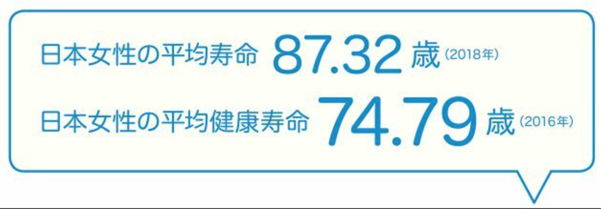
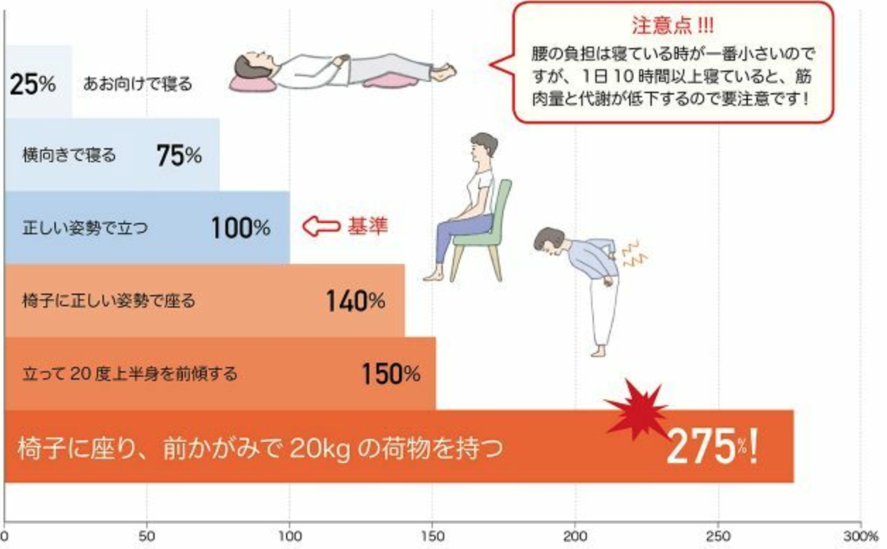

# 概论

人間は二本足で歩くことができます。二足歩行は動物の四足歩行に比べると腰にかかる負担が大きくなってしまいます。腰痛の約８割は姿勢の悪化によって、腰の負担が増えることで引き起こされています。正しい姿勢を保つために必要な筋肉を維持するセルフケアで改善や予防が可能です。

ただし、筋肉や骨は年齢を重ねることで確実に衰えていきます。この場合、腰痛を引き起こしてしまうのです」

自動車の普及や公共交通の発達、さらに最近はバリアフリーのためにエレベーターやエスカレーターの設置が増加したことで、多くの現代人は歩く機会が減って運動不足に陥っています。その結果、正しい姿勢を保つために必要な筋肉が衰え、腰痛に悩む人が増えているのです。

骨・椎間板・神経に問題が起きる病気が原因の腰痛と、尿路結石など内臓の病気の症状として現れる腰痛の２種類があります。実は、前者の腰痛も加齢が要因であることがほとんどです」
そのため、腹筋・背筋・大臀筋の筋肉量を維持し、正しい姿勢を保つことで、ある程度の予防や症状の改善は可能とされています。

「もっとも、骨粗しょう症は筋肉量だけでなく、骨量にも注意しなければなりません。骨粗しょう症の患者は80％が女性ですが、それは閉経によって女性ホルモンのエストロゲンの分泌が激減するからです。エストロゲンは骨の新陳代謝のサイクルで、骨からカルシウムが溶け出す『骨吸収』を抑制する働きがあります。そのため、閉経後の女性は丈夫な骨を作ることが難しくなり、骨密度が低下した骨は転倒などちょっとした衝撃で折れやすくなりますが、特に怖いのが、背骨の圧迫骨折です」

「新陳代謝によって骨は生まれ変わりますが、やはり骨粗しょう症は若いうちから骨密度の低下を防ぐ生活習慣を身につけることが大切になってきます。

- カルシウムの吸収をよくする働きを持つビタミンＤや、骨の形成を促すビタミンＫなども一緒に摂取する必要があります。
- 人間の体は日光に当たることで、体内でのビタミンＤの生成が促されるようになっています。
- 適度な運動によって骨に刺激を与えることで骨の新陳代謝が促されるため、ウォーキングや散歩をするついでに日光浴もしてしまいましょう。
- 肉を食べる時は牛肉や豚肉に比べるとヘルシーな鶏肉を選ぶようにしましょう

####適度な運動

- 基本はやはり歩くことです。１日の合計の歩数が5000～6000歩を目安にしましょう。
- 体操やストレッチもおすすめですが、静止の動作によって筋肉を鍛えるアイソメトリックス・トレーニング（等尺性収縮運動）がおすすめですね」

### 治療が必要になる約２割の腰痛、どういった治療が行われるのでしょうか。
- 症状が腰痛だけ：骨や関節、その周辺の筋肉・靭帯・神経に関する病気の治療を行っている整形外科を受診するのが一般的です
- 保存的療法：筋肉を鍛えるための運動の指導（運動療法）、患部を温めたり電気を通したりすることで痛みを緩和（物理療法）、腰痛を引き起こす動作や習慣の改善の指導、そして薬を投与する薬物療法などの総称です。

### 原文

腰痛を予防するには？ 医師に聞く「腰の健康寿命」を守るポイント。

人間にとって腰痛は、生涯で一度は悩まされる症状で、年をとるほど悩む人が増えていきます。どうすれば腰痛を予防できるのか、整形外科医の伊藤晴夫さんに「腰の健康寿命」を守るポイントを教えてもらいました。

人間の体の耐久年数は平均寿命よりも短い

人間は他の動物とは異なり、二本足で歩くことができます。それはお尻の筋肉である大臀筋（だいでんきん）が骨盤の傾きを約30度に維持し、腹筋と背筋によって骨盤の上にある背骨が上半身を支えるのを助けているからです。
ところが、二足歩行は動物の四足歩行に比べると腰にかかる負担が大きくなってしまいます。正しい姿勢で立っていても、体重と同じ力が腰にかかってしまうからです。その力は腰の椎間板（骨と骨の間で衝撃を吸収するクッションのような役割を果たしている軟骨）にも負担をかけます。
そのため、さまざまな腰痛の治療にあたってきた伊藤晴夫さんは「腰痛の約８割は姿勢の悪化によって、腰の負担が増えることで引き起こされています。こうした腰痛は、正しい姿勢を保つために必要な筋肉を維持するセルフケアで改善や予防が可能です」と教えてくれました。
「ただし、筋肉や骨は年齢を重ねることで確実に衰えていきます。例えば、椎間板に含まれている水分は加齢とともに失われてゆき、弾力が落ちた椎間板は衝撃を吸収できずに潰れてしまいます。この場合、潰れた椎間板が周囲の靭帯（じんたい）や筋肉に悪影響を及ぼし、腰痛を引き起こしてしまうのです」

【女性が自覚する病気やけが上位５症状】

自動車の普及や公共交通の発達、さらに最近はバリアフリーのためにエレベーターやエスカレーターの設置が増加したことで、多くの現代人は歩く機会が減って運動不足に陥っています。その結果、正しい姿勢を保つために必要な筋肉が衰え、腰痛に悩む人が増えているのです。
若い世代にも腰痛に悩む人は少なくありませんが、圧倒的に高齢者の方が多いのは、腰痛の原因に「老化」が関わっているからです。
「日本の平均寿命は戦後から延び続け、現在は男女ともに80歳を超えている高齢化社会です。でも残念なことに、肉体の耐久年数は寿命の延びに追いついていません」
確かに、本や新聞の文字が読みづらくなる老眼をはじめ、聴力や記憶力の低下といった体の機能の衰えが40代頃から始まるのは、昔からあまり変わっていません。
「年をとってからの腰痛は、老化によって骨が変化しているせいで、セルフケアでの改善が難しく、治療が必要になってくることがほとんどです。ですから、筋肉や骨の状態がまだ若いうちから、腰痛にならないように心がけることが大切になってきます。いわば『転ばぬ先の杖（つえ）』というやつですね」
【姿勢による腰への負担】

女性は特に気をつけたい骨粗しょう症の圧迫骨折
腰痛の約８割はセルフケアで予防や改善が可能とのことですが、治療が必要となる残り約２割の腰痛の原因は何でしょうか。
「脊柱管狭窄症（せきちゅうかんきょうさくしょう）、腰椎椎間板ヘルニア、骨粗しょう症に伴う圧迫骨折など、骨・椎間板・神経に問題が起きる病気が原因の腰痛と、尿路結石など内臓の病気の症状として現れる腰痛の２種類があります。実は、前者の腰痛も加齢が要因であることがほとんどです」
そのため、腹筋・背筋・大臀筋の筋肉量を維持し、正しい姿勢を保つことで、ある程度の予防や症状の改善は可能とされています。
「もっとも、骨粗しょう症は筋肉量だけでなく、骨量にも注意しなければなりません。骨粗しょう症の患者は80％が女性ですが、それは閉経によって女性ホルモンのエストロゲンの分泌が激減するからです。エストロゲンは骨の新陳代謝のサイクルで、骨からカルシウムが溶け出す『骨吸収』を抑制する働きがあります。そのため、閉経後の女性は丈夫な骨を作ることが難しくなり、骨密度が低下した骨は転倒などちょっとした衝撃で折れやすくなりますが、特に怖いのが、背骨の圧迫骨折です」
　圧迫骨折による腰の痛みも大変ですが、圧迫骨折していることに気づかなかったことで適切な治療が受けられず、潰れた状態で骨が固まり背骨が曲がってしまうと、もっと大変です。背骨は上半身を支えているため、必然的に姿勢も悪くなってしまい、腰痛が引き起こされてしまいます。
このような場合、骨自体が変形してしまっているので、筋肉を鍛えても正しい姿勢をとることができず、腰の痛みは改善しません。
「新陳代謝によって骨は生まれ変わりますが、やはり骨粗しょう症は若いうちから骨密度の低下を防ぐ生活習慣を身につけることが大切になってきます。まず注意してほしいのが、丈夫な骨を作るために必要な栄養をこまめに摂取することです」
骨を作るために必要な栄養といえば、まず思い浮かぶのがカルシウムです。ところが、カルシウムを摂取するだけでは骨は丈夫になりません。カルシウムの吸収をよくする働きを持つビタミンＤや、骨の形成を促すビタミンＫなども一緒に摂取する必要があります。
ただし、ビタミンＤを含む食べ物は数が限られているため、毎日の食事で十分な量を摂取するのは難しい……そこで大切になってくるのが日光浴だそうです。
「最近の女性は美容のために紫外線を敬遠していますが、人間の体は日光に当たることで、体内でのビタミンＤの生成が促されるようになっています。
さらに、適度な運動によって骨に刺激を与えることで骨の新陳代謝が促されるため、ウォーキングや散歩をするついでに日光浴もしてしまいましょう。ただし、日焼けだけでなく熱中症の心配もありますので、あまり紫外線や気温が強くない午前中や夕方の時間帯がおすすめです。
ちなみに、極端に日照時間の少ない北欧ではありませんので、全身に日光を浴びる必要はありません。顔やデコルテ部分を防御する一方で、手や足など多少日焼けしても大丈夫な部位に日光を当てる部分浴で十分です」

「適度な運動」は具体的にどれぐらいのどんな運動？
クロワッサン オンライン

腰痛を予防するためには、具体的にどんな運動がおすすめでしょうか。
「基本はやはり歩くことです。そうすることで、正しい姿勢を保つために不可欠な腹筋・背筋・大臀筋の３種類の筋肉を維持できます。
よく『１日１万歩』と言われていますが、年配の方にとってはこの歩数はかえって負担になりますので、１日の合計の歩数が5000～6000歩を目安にしましょう。
また、筋肉を鍛えるために体操やストレッチもおすすめですが、激しい動きを伴うものは、骨や筋肉が衰えている年配の方にとってやはり負担が大きくなります。毎日続けるためには、静止の動作によって筋肉を鍛えるアイソメトリックス・トレーニング（等尺性収縮運動）がおすすめですね」
腰の痛みが激しい時は安静にすべきですが、最近では痛みが弱まってきたら、筋肉が衰えないように積極的に体を動かすのが腰痛対策の常識となっているそうです。

日常生活に対する伊藤さんからのアドバイス
クロワッサン オンライン

「適度な運動」は歩くこと。連続してではなく、１日の合計歩数が5000～6000歩であれば大丈夫です。全身を動かしながら酸素を取り入れる有酸素運動なので、脂肪を燃焼させてくれるため、腰痛のもう一つの要因である肥満対策にもなります。ウォーキングの注意点は66ページで詳しく紹介しています。

クロワッサン オンライン

骨の材料であるカルシウムの吸収を助けてくれるビタミンD は、日光に当たることで体内での生成が促されます。ただし、日本では（特に夏は）紫外線が強いため、午前中や夕方など日差しが弱い時間帯に当たるとよいでしょう。全身に浴びる必要はないので、手足など体の一部に浴びるだけで大丈夫です。

クロワッサン オンライン

骨の材料となるカルシウム、カルシウムの吸収を助けてくれるビタミンD、骨の形成を促すビタミンK、そして筋肉の材料となるたんぱく質などを積極的に摂取しましょう。なお、たんぱく質が豊富な肉は脂肪分も高めのため、肉を食べる時は牛肉や豚肉に比べるとヘルシーな鶏肉を選ぶようにしましょう。

治療が必要な腰痛でも手術になるのはわずか
クロワッサン オンライン

治療が必要になる腰痛は約２割とのことですが、どういった治療が行われるのでしょうか。
「症状が腰痛だけの場合は、骨や関節、その周辺の筋肉・靭帯・神経に関する病気の治療を行っている整形外科を受診するのが一般的です。『外科』という言葉は手術のイメージが強いようですが、腰痛治療で手術になるのは手術以外の方法で解決できないときで、基本的に保存的療法になります」
保存的療法とは、筋肉を鍛えるための運動の指導（運動療法）、患部を温めたり電気を通したりすることで痛みを緩和（物理療法）、腰痛を引き起こす動作や習慣の改善の指導、そして薬を投与する薬物療法などの総称です。
「脊柱管狭窄症や腰椎椎間板ヘルニアは『神経根（しんけいこん）型』と『馬尾（ばび）型』というタイプに分かれていますが、患者の割合は神経根型が９に対して馬尾型が１ぐらい。手術が必要になってくるのは、この馬尾型でも麻痺症状を伴う場合は手術を急ぎますが、それ以外は長期間（２～３ヶ月以上）強い症状が続く場合に手術をすすめます」

腰痛で手術になるのは、保存的療法を行っても長期間症状が改善しない場合や、間欠性跛行（はこう）（少し歩くと足が痛みやしびれで動かなくなり、休むとまた歩けるようになること）や排便・排尿がしづらくなるといった神経障害が現れた場合です。神経障害はかなり状態が悪化しているシグナルのため、放置すれば手術しても後遺症が残る可能性もあります。
「例えば腰椎椎間板ヘルニアの手術には、背中を５センチほど切開して、執刀医が肉眼で患部を見ながらヘルニアを摘出する『ラブ法』という手法がありますが、技術や機器が常に進歩していますので、患者の体にかかる負担は、昔に比べればかなり減っています。内視鏡手術の場合は、ラブ法よりも切開の範囲が小さいため、術後の回復も早くなりますね」
ただし、同じ病気であっても、患部の状態は患者一人一人で異なります。そのため、内視鏡が使えない状態であったり、内視鏡を使った手術が最適でなかったりすることもあるそうです。

【通院理由となる上位５傷病】

【（男性）通院理由となる上位５傷病】※厚生労働省が平成28年に実施した国民生活基礎調査より引用。　※人口1000人あたりの、病気やけがで通院している人の比率で、複数回答。 ※分子の通院者には入院者を含まないが、分母となる世帯人員には入院者を含む。　※...

【注意点!!!】
男女ともに通院の理由第１位の高血圧に比べると、腰痛症は数字が小さく見えますが、腰痛の予防・改善（適度な運動とバランスのよい食事）をしていれば、高血圧症のリスクも減ります。

違和感や不安があればすぐに病院で診察を
クロワッサン オンライン

日本の女性は男性よりも平均寿命が長いため、加齢も大きな要因である腰痛の対策は、老後のことを考えれば大切になってきます。
「実は、女性ホルモンのエストロゲンは骨吸収だけでなく、コレステロールの調整もしてくれています。閉経した女性に内臓脂肪がつきやすいのはこのためです。お腹回りに脂肪がついてしまうと、骨盤が前に傾いて姿勢が悪化し、腰痛が引き起こされます。
また、家事の大半を女性が担っていますが、掃除や洗濯は腰を曲げる動作が多くなります。
そうしたことを考えると、男性よりも女性のほうが腰痛のリスクは高いといえますね。ただ、女性はもともと痛みに強いうえ、年配の方ほど我慢強い方が多い。
痛みは体からの異常のシグナルですから、違和感や不安を覚えたら、一度病院で診察を受けてみてください。ただの運動不足だとわかれば、腰痛の悪化を恐れずに体を動かすことができますし、治療が必要な病気が判明すれば、症状の悪化を防げます」

【生活にサポートが必要になったきっかけベスト３】
骨折などによって寝たきり⇒認知症になる可能性が高いことを考えると
【腰痛】を放置することは老後の生活の質を落とします！